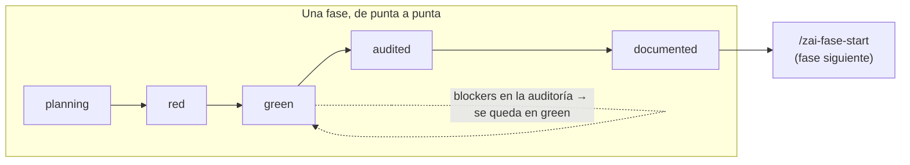

# ZAI

**Entorno de desarrollo personal sobre [OpenCode](https://opencode.ai)** — disciplina de proceso forzada a nivel de herramienta, no de buena voluntad.

Existe porque "acordate de no editar los tests" es un consejo que un agente
olvida en la fase 4. ZAI hace que ciertas cosas sean **imposibles**, no solo
desaconsejadas: un agente no puede tocar un test mientras la fase está en
`green`, no puede auditar su propio código, no puede usar una librería
joven sin haber consultado su documentación actual, y — si vos lo pedís —
no puede commitear sin haber documentado.

No es un framework. Es un **toolkit de módulos independientes**: instalá
todos, desactivá el que no te sirva, o construí uno nuevo sin tocar los
demás.

---

## Índice

- [Qué construye](#qué-construye)
- [Instalación](#instalación)
- [Guía rápida](#guía-rápida)
- [Módulos](#módulos)
- [Cómo funciona](#cómo-funciona)
- [Variables de entorno](#variables-de-entorno-zai_)
- [Desactivar, actualizar, desinstalar](#desactivar-actualizar-desinstalar)
- [Más documentación](#más-documentación)

## Qué construye

Cuatro piezas, cada una un módulo instalable por separado:

1. **Estado de fase por proyecto** (`.zai/state.json`) — una máquina de
   estados validada (`planning → red → green → audited → documented`) que
   se inyecta sola en el contexto de cada sesión de OpenCode, sin que se la
   pidas.
2. **Un loop de fases con agentes de permisos mínimos** — `zai-planner`
   orquesta, `zai-test-author` solo escribe tests, `zai-implementer` solo
   toca código (nunca tests — bloqueado a nivel de herramienta), `zai-auditor`
   es de solo lectura (ni siquiera puede escribir su propio reporte), y
   `zai-scribe` cierra la fase con ADR (si amerita), changelog y versión.
3. **Reglas de stack como conocimiento on-demand** — un árbol de decisión
   (Express vs NestJS, BullMQ vs pg-boss vs RabbitMQ, etc.) que se carga
   solo cuando aplica, más un gate que exige consultar documentación
   actualizada antes de usar una dependencia joven.
4. **Buenas prácticas de ingeniería, también on-demand** — commits,
   changelogs, comentarios, tipado, arquitectura, patrones de diseño,
   seguridad defensiva y testing, con criterio real de cuándo aplica cada
   cosa, no un catálogo genérico.

## Instalación

**Requisitos**: Node 18+, pnpm, y `opencode-ai` instalado
(`npm i -g opencode-ai`).

Este repo **no es** el directorio de config de OpenCode — clonalo donde
quieras tener tus repos. El instalador copia/enlaza lo necesario hacia
`~/.config/opencode` (o `OPENCODE_CONFIG_DIR` si lo tenés seteado), que es
donde OpenCode realmente lee su configuración.

```sh
git clone <este-repo> <donde-quieras>
cd <donde-quieras>
pnpm install
pnpm install:zai
```

Confirmá que quedó instalado:

```sh
opencode debug config
```

Deberías ver `zai.core.ts`, `zai.phases.ts` y `zai.stack.ts` en `"plugin"`,
los cinco agentes `zai-*` en `"agent"`, los ocho comandos `/zai-*` en
`"command"`. Con `opencode debug skill` deberías ver los cinco skills
`zai-stack-*` y los ocho `zai-practices-*`.

Paso a paso más largo, con ejemplos y qué hacer si algo no coincide con lo
que ves: **`docs/GUIDE.md`**.

## Guía rápida

Parado en cualquier proyecto (con OpenCode ya corriendo):

```
/zai-init
```

Te va a preguntar, de a una: nombre del proyecto, qué resuelve, qué queda
afuera, y después las fases en las que pensás dividir el trabajo. Al
terminar tenés `.zai/state.json`, `docs/VISION.md`, `docs/tasks.md`, y el
spec de la fase 1.

De ahí, el loop por cada fase:

```
/zai-fase-red     # zai-test-author escribe los tests, se confirma que fallan
/zai-fase-green   # zai-implementer los hace pasar (no puede tocarlos — Gate A)
/zai-fase-audit   # zai-auditor revisa el diff con contexto limpio
/zai-fase-fix     # si hubo blockers, se corrigen y se vuelve a auditar
/zai-fase-close   # suite completa, ADR si amerita, changelog, versión, cierre
```

Para la fase siguiente: `/zai-fase-start`. En cualquier momento, `/zai-estado`
te dice dónde estás sin que tengas que abrir el archivo.

Ejemplo completo con salidas reales (no simulado): **`docs/GUIDE.md`**.

## Módulos

| Módulo | Qué trae | ¿Se puede desactivar? |
|---|---|---|
| **`core`** | `.zai/state.json`, el gate que inyecta estado al contexto, `/zai-estado`, `/zai-init` | No — todo lo demás depende de él |
| **`phases`** | 5 agentes (`zai-planner`, `zai-test-author`, `zai-implementer`, `zai-auditor`, `zai-scribe`), 6 comandos `/zai-fase-*`, Gate A (tests intocables), Gate B (typecheck/lint post-escritura), Gate D (bloqueo de commit, apagado de fábrica) | Sí |
| **`stack`** | 5 skills `zai-stack-*` (árbol de decisión on-demand), Gate E (exige `context7` antes de dependencias jóvenes) | Sí |
| **`practices`** | 8 skills `zai-practices-*` — commits, changelog, comentarios, tipado, arquitectura, patrones de diseño, seguridad defensiva (investigada con fuentes de 2025-2026), testing | Sí |

Cada uno tiene su propio `module.json` en `modules/<nombre>/`. Instrucciones
para agregar uno propio: `docs/MODULES.md`.

## Cómo funciona



`.zai/state.json` es la única fuente de verdad sobre en qué fase y estado
está un proyecto. Una sola función (`transitionPhaseState`) puede
modificarlo, valida cada salto contra la máquina de estados de arriba, y
escribe atómicamente. El plugin `zai.core` lee ese archivo al arrancar
cada sesión e inyecta el estado y el spec de la fase actual en el contexto
— sin que se lo pidas, sin ocupar espacio si el proyecto no usa ZAI.

Los **gates** (A, B, D, E) son plugins de OpenCode que interceptan
llamadas a herramientas (`tool.execute.before`/`after`, ver
`docs/RESEARCH.md`) y **tiran un error real** cuando algo viola una regla
— no son una instrucción en un prompt que el modelo puede decidir
ignorar.

## Variables de entorno `ZAI_*`

| Variable | Efecto |
|---|---|
| `ZAI_DISABLE_GATES` | Apaga **todos** los gates de todos los módulos. El escape hatch de emergencia. |
| `ZAI_PHASES_DISABLE_GATE_A` | Apaga solo Gate A (tests intocables en `green`). |
| `ZAI_PHASES_DISABLE_GATE_B` | Apaga solo Gate B (typecheck/lint post-escritura). |
| `ZAI_ALLOW_COMMIT` | Bypassea Gate D para ese commit puntual, aunque esté prendido en `.zai/config.json`. |
| `ZAI_STACK_DISABLE_GATE_CONTEXT7` | Apaga solo Gate E (exige `context7` antes de dependencias jóvenes). |

Ninguna necesita un valor específico — alcanza con que exista
(`ZAI_DISABLE_GATES=1`, `=true`, lo que sea).

**Gate D (bloqueo de commit)** es el único apagado de fábrica: para
prenderlo, `.zai/config.json` con `{ "commitGate": true }` en el proyecto
consumidor.

## Desactivar, actualizar, desinstalar

**Desactivar un módulo**: `"enabled": false` en su `modules/<nombre>/module.json`,
después `pnpm install:zai` de nuevo. El código se queda en el repo, solo
deja de estar instalado.

**Actualizar** (después de `git pull` o de editar algo): `pnpm install:zai`
de nuevo — es idempotente, re-sincroniza todo.

**Desinstalar todo limpio**:

```sh
pnpm uninstall:zai
```

Borra exactamente lo que instaló (lee su propio manifiesto, nunca toca un
archivo que no reconoce). No borra `.zai/` de ningún proyecto — eso es
estado tuyo, no de la herramienta.

## Cómo corro los tests del entorno

```sh
pnpm test         # vitest run
pnpm typecheck     # tsc --noEmit
```

## Más documentación

| Documento | Para qué |
|---|---|
| **`docs/GUIDE.md`** | Guía paso a paso de instalación y uso, con ejemplos reales |
| `docs/RESEARCH.md` | El contrato de API de OpenCode — todo lo que este repo usa, verificado con fuente y fecha |
| `docs/NAMESPACE.md` | La convención de nombres, y por qué |
| `docs/MODULES.md` | Cómo agregar un módulo nuevo |
| `docs/DECISIONS.md` | Supuestos y desviaciones del diseño original, justificados |
| `docs/HANDOFF.md` | Qué quedó sólido y qué quedó frágil, sesión a sesión |
| `docs/POSTMORTEM.md` | Balance honesto al cierre del proyecto |
| `CHANGELOG.md` | Historial de versiones de ZAI mismo (no de tus proyectos — esos tienen el suyo, mantenido por `zai-scribe`) |
